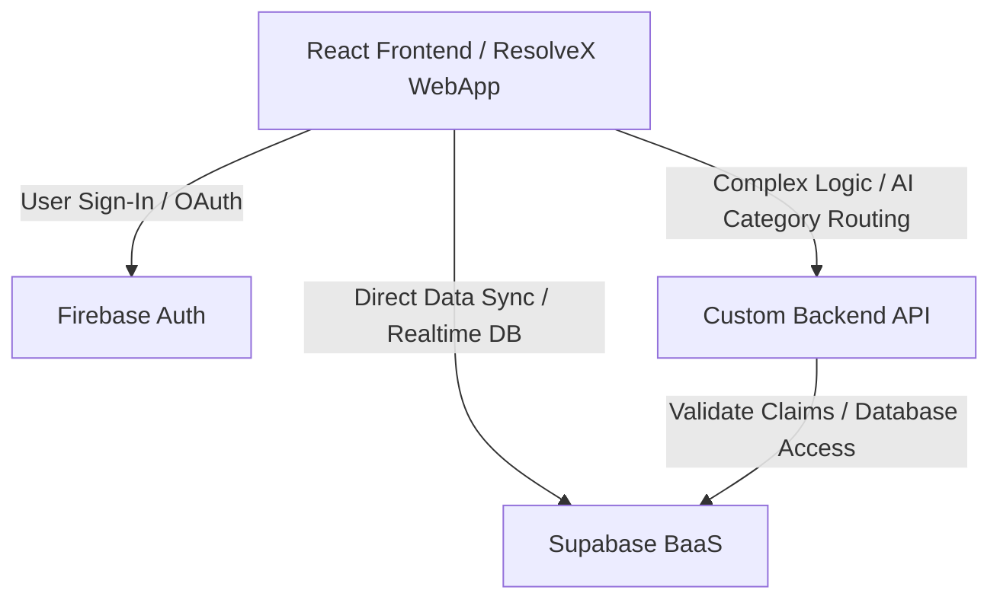

# ResolveX — Premium Complaint Management System

ResolveX is an enterprise-grade SaaS platform designed to capture, route, track, and resolve complaints across various departments with complete transparency and accountability. 

This repository currently hosts the **interactive landing page** and **authentication portal**, built with a premium, minimalist dark aesthetic inspired by Apple, Linear, and Stripe.

---

## 🚀 Landing Page Key Features

The frontend landing page has been fully developed with a focus on product storytelling, performance, and modern design principles:
*   **Premium Minimalist Dark Theme:** High-contrast layout using deep blacks, vibrant blues, and subtle gradients.
*   **Smooth Scroll Performance:** Integrated with [Lenis](https://github.com/darkroomengineering/lenis) for smooth, buttery scroll mechanics.
*   **Interactive Components:**
    *   **Hero Section:** Dynamic layout with typography, CTAs, and custom workflow animation.
    *   **Problem & Solution Sections:** Structured cards and a sticky interactive dashboard showcase.
    *   **Interactive Workflow Timeline:** Step-by-step resolution flow showing citizen actions, AI verification, and department routing.
    *   **Mock Authentication Portal:** Fully interactive custom login and sign-up interface.
    *   **Interactive FAQ Accordion:** Clean, animated question-and-answer panels.

---

## 🛠️ Current Technology Stack (Frontend)

The frontend is light, high-performance, and uses modern toolchains:

| Layer | Technology | Purpose |
| :--- | :--- | :--- |
| **Framework** | [React 19](https://react.dev/) | Component-based interactive UI rendering |
| **Build Tool** | [Vite 8](https://vite.dev/) | Ultra-fast development server and production bundler |
| **Styling** | Vanilla CSS | Custom, precise styling control (responsive grids, flexbox, variables) |
| **Icons** | [Lucide React](https://lucide.dev/) | Clean, consistent vector icon library |
| **Smooth Scrolling** | [Lenis](https://github.com/darkroomengineering/lenis) | Web-gl/CSS-compliant smooth scrolling engine |
| **Linter** | [Oxlint](https://oxc.rs/docs/guide/usage/linter.html) | High-performance, Rust-based JavaScript linting |

---

## 🔮 Future Architecture & Backend Stack

For the full production deployment, the proposed architecture combines modern Backend-as-a-Service (BaaS) platforms with custom application servers where needed.



### Decided Core Components
1.  **Authentication: Firebase Auth**
    *   *Why:* Offers simple cross-platform SDKs, robust multi-factor authentication, and out-of-the-box social login integrations (Google, Microsoft, GitHub, etc.).
2.  **Database & Storage: Supabase (PostgreSQL)**
    *   *Why:* Realtime database sync capabilities, built-in Row Level Security (RLS), auto-generated REST/GraphQL APIs, and scalable object storage for file uploads.

### Backend Language & Framework (Under Consideration)
To run custom API logic (such as AI complaint routing and third-party notifications), we are evaluating the following backend technologies:

#### Option A: Node.js (TypeScript) with Express / NestJS (Recommended)
*   **Pros:** Unifies the tech stack in JavaScript/TypeScript across frontend and backend. NestJS provides an enterprise-ready architecture (DI, testing, controllers). Large ecosystem with native SDKs for Supabase and Firebase.
*   **Cons:** Higher runtime memory footprint compared to Compiled/System languages.

#### Option B: Python with FastAPI
*   **Pros:** Ideal if we plan to write native AI/ML pipelines (such as using HuggingFace or LangChain for automatic complaint categorization, classification, and sentiment analysis). Very fast development cycle.
*   **Cons:** Context-switching between JS (frontend) and Python (backend).

#### Option C: Go (Golang)
*   **Pros:** Extremely high performance, minimal memory footprints, and built-in concurrency support. Excellent for high-throughput messaging or microservices.
*   **Cons:** Steeper learning curve and boilerplate code compared to Node.js/Python.

---

## 📂 Project Structure

```bash
CMS_V2/
├── public/                 # Static assets (logos, animations)
├── src/
│   ├── assets/             # Images and styles
│   ├── components/         # Reusable React components
│   │   ├── Auth.jsx        # Login/Sign-up views
│   │   ├── Hero.jsx        # Landing hero
│   │   ├── Workflow.jsx    # Complaint routing process visualizer
│   │   └── ...             # Other landing page sections
│   ├── App.jsx             # Main Application root & Lenis wrapper
│   ├── index.css           # Global custom CSS rules
│   └── main.jsx            # Application entry point
├── package.json            # Scripts & dependencies
└── vite.config.js          # Vite config
```

---

## 💻 Getting Started

Follow these steps to run the landing page locally:

### 1. Prerequisites
Ensure you have [Node.js](https://nodejs.org/) installed (v18+ recommended).

### 2. Install Dependencies
```bash
npm install
```

### 3. Run the Development Server
```bash
npm run dev
```
The application will be accessible at `http://localhost:5173`.

### 4. Build for Production
```bash
npm run build
```
This generates optimized static files in the `/dist` directory.
