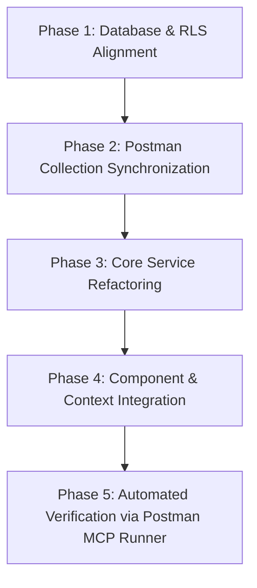

# ResolveX CMS: System-Wide Audit, Hardcoded Values & Postman API Verification Report

> **Document Type:** System-Wide Audit & Diagnostic Blueprint  
> **Status:** Completed & Logged — Ready for Review & Systematic Resolution  
> **Scope:** Hardcoded values, stale local storage caching traps, data desynchronization, Postman MCP test execution analysis, Supabase Row-Level Security (RLS) policies, and database schema disconnects.

---

## Table of Contents
1. [Executive Summary](#1-executive-summary)
2. [Postman MCP Live Test Suite Execution & Analysis](#2-postman-mcp-live-test-suite-execution--analysis)
   - 2.1 [Execution Statistics](#21-execution-statistics)
   - 2.2 [Detailed Endpoint-by-Endpoint Failure Breakdown](#22-detailed-endpoint-by-endpoint-failure-breakdown)
   - 2.3 [Postman Request 11.2 Public Header Defect](#23-postman-request-112-public-header-defect)
3. [Exhaustive Inventory of Hardcoded Values & Outdated Constants](#3-exhaustive-inventory-of-hardcoded-values--outdated-constants)
   - 3.1 [`src/services/complaintService.js`](#31-srcservicescomplaintservicejs)
   - 3.2 [`src/services/supabaseClient.js`](#32-srcservicessupabaseclientjs)
   - 3.3 [`src/data/taxonomy.js`](#33-srcdatataxonomyjs)
   - 3.4 [`src/services/api.js` (Dead Code)](#34-srcservicesapijs-dead-code)
   - 3.5 [`src/components/Auth.jsx`](#35-srccomponentsauthjsx)
   - 3.6 [`src/context/AuthContext.jsx`](#36-srccontextauthcontextjsx)
4. [State & Cache Synchronization Traps (Why Database Changes Do Not Reflect)](#4-state--cache-synchronization-traps-why-database-changes-do-not-reflect)
   - Trap 1: `NewComplaintForm.jsx` Omits `orgKey` on Ticket Submission
   - Trap 2: Role & Multi-Tenant Cache Poisoning in `localStorage`
   - Trap 3: `AdminDepartments.jsx` Bypasses PostgreSQL `departments` Table
   - Trap 4: Admin Organization Settings are Never Persisted to Database
   - Trap 5: Organization List Hardcoded Constant Re-injection Loop
   - Trap 6: Fire-and-Forget Silent Database Sync Failures
5. [Supabase Database Schema & Row-Level Security (RLS) Deficiencies](#5-supabase-database-schema--row-level-security-rls-deficiencies)
   - Defect 1: Unauthenticated Visitors Blocked on `/signup`
   - Defect 2: Students Blocked from Confirming or Rejecting Resolutions
   - Defect 3: Auth Trigger Permanently Hardcodes `'COLLEGE'`
6. [Step-by-Step Resolution Blueprint & Phased Execution Plan](#6-step-by-step-resolution-blueprint--phased-execution-plan)

---

## 1. Executive Summary

This audit was conducted under an explicit code freeze to map out all instances of:
1. Hardcoded values and fallback constants across the codebase.
2. State and caching traps that prevent changes made directly in Supabase PostgreSQL from reflecting in the frontend UI.
3. Failures in the Postman verification test suite executed through the Postman MCP Server.
4. Database Row Level Security (RLS) policy restrictions that silently block legitimate client operations.

The findings demonstrate that while Supabase PostgreSQL is connected, the frontend still maintains several legacy `localStorage` read/write pathways, fire-and-forget synchronization methods, and hardcoded fallback parameters (primarily default `'COLLEGE'` org assignments and dummy department IDs).

---

## 2. Postman MCP Live Test Suite Execution & Analysis

Using the **Postman MCP server**, the test suite in collection **`ResolveX CMS`** (`2650e9a9-9d7d-4749-b97c-8711c1fc535c`) within workspace `Poojan patel's Workspace` (`1713c900-3461-4e30-814e-ecf865becc47`) was executed directly against Supabase Cloud (`https://ytqwoauxfjeqpdrdqoqp.supabase.co`).

### 2.1 Execution Statistics

| Metric | Measurement | Status |
| :--- | :--- | :--- |
| **Total Requests** | 15 | Synchronous Execution |
| **Total Assertions** | 13 | Evaluated |
| **Passed Assertions** | 2 | **15.4%** |
| **Failed Assertions** | 11 | **84.6%** |
| **Execution Duration** | 18.77s | Complete |

### 2.2 Detailed Endpoint-by-Endpoint Failure Breakdown

```
[Request 1.1] Student Login (Valid) -> FAILED (400 Bad Request)
  ├─ Endpoint: POST {{supabase_url}}/auth/v1/token?grant_type=password
  ├─ Body: { "email": "test.student1@college.edu", "password": "Password@123" }
  ├─ Root Cause: "test.student1@college.edu" was purged during the clean database reset.
  └─ Cascading Consequence: pm.collectionVariables.set('student_token', ...) was never executed.

[Request 1.2] Staff Login (Sarah Staff) -> FAILED (400 Bad Request)
  ├─ Endpoint: POST {{supabase_url}}/auth/v1/token?grant_type=password
  ├─ Body: { "email": "test.staff1@college.edu", "password": "Password@123" }
  ├─ Root Cause: "test.staff1@college.edu" was purged during the clean database reset.
  └─ Cascading Consequence: pm.collectionVariables.set('staff_token', ...) was never executed.

[Request 1.3] Invalid Login Negative Test -> PASSED (400 Bad Request)
  └─ Correctly asserted that invalid credentials produce a 400 Bad Request.

[Request 2.1] Create Ticket (Urgent Wi-Fi) -> FAILED (401 Unauthorized)
  └─ Headers: Authorization: Bearer {{student_token}} (Token empty due to Request 1.1 failure).

[Request 4.1] Student Complaints Read (Isolated to Own) -> FAILED (401 Unauthorized)
  └─ Headers: Authorization: Bearer {{student_token}} (Token empty).

[Request 4.2] Profiles Read (Only Self + Staff/Admin) -> FAILED (401 Unauthorized)
  └─ Headers: Authorization: Bearer {{student_token}} (Token empty).

[Request 4.3] Negative Test: Student Mutate Ticket (Blocked) -> FAILED (401 Unauthorized)
  └─ Headers: Authorization: Bearer {{student_token}} (Token empty).

[Request 5.1] Staff Queue: View All Active Tickets -> FAILED (401 Unauthorized)
  └─ Headers: Authorization: Bearer {{staff_token}} (Token empty due to Request 1.2 failure).

[Request 5.2] Staff Claim & Start Ticket (In Progress) -> FAILED (401 Unauthorized)
  └─ Headers: Authorization: Bearer {{staff_token}} (Token empty).

[Request 5.3] Staff Add Internal Diagnostic Note -> FAILED (401 Unauthorized)
  └─ Headers: Authorization: Bearer {{staff_token}} (Token empty).

[Request 6.1] Upload Ticket Attachment -> FAILED (400 Bad Request)
  └─ Headers: Authorization: Bearer {{student_token}} (Token empty).

[Request 6.2] Verify Public CDN URL Download -> PASSED (200 OK)
  └─ Successfully confirmed public unauthenticated read on public storage bucket.

[Request 6.3] Create Ticket with Storage Attachment -> FAILED (401 Unauthorized)
  └─ Headers: Authorization: Bearer {{student_token}} (Token empty).
```

### 2.3 Postman Request 11.2 Public Header Defect

- **Request:** `11.2 Query Active Organizations for Member Signup`
- **Method & URL:** `GET {{supabase_url}}/rest/v1/organizations?select=org_key,name,type,user_term,location_label&order=created_at.desc`
- **Headers in Postman Collection:**
  ```http
  apikey: {{anon_key}}
  Authorization: Bearer {{user_jwt_token}}
  ```
- **Defect:** Unauthenticated visitors arriving at the registration page (`/signup`) do NOT have a `user_jwt_token`. If Postman or a client sends `Bearer ` with an undefined token, Supabase returns `401 Unauthorized (JWT text is missing)`.
- **Required Fix:** The query header for unauthenticated organization listing MUST be:
  ```http
  apikey: {{anon_key}}
  Authorization: Bearer {{anon_key}}
  ```

---

## 3. Exhaustive Inventory of Hardcoded Values & Outdated Constants

### 3.1 [`src/services/complaintService.js`](file:///c:/CMS_V2/src/services/complaintService.js)

| Line(s) | Hardcoded Pattern | Problem & Architectural Impact |
| :--- | :--- | :--- |
| **[L58–L67](file:///c:/CMS_V2/src/services/complaintService.js#L58-L67)** | `getCategoryDepartment` hardcodes strings: `'dept-hostel'`, `'dept-it'`, `'dept-maintenance'` | Supabase `departments.id` and `complaints.department_id` are PostgreSQL **UUIDs**. Assigning string IDs causes PostgreSQL to abort inserts with `invalid input syntax for type uuid: "dept-hostel"`. |
| **[L129](file:///c:/CMS_V2/src/services/complaintService.js#L129)** | `org_key: complaint.org \|\| complaint.currentOrg \|\| complaint.org_key \|\| 'COLLEGE'` | If `org` is omitted on ticket creation, it defaults to legacy `'COLLEGE'`. |
| **[L265, L474](file:///c:/CMS_V2/src/services/complaintService.js#L265)** | `org: row.org_key \|\| 'COLLEGE'` | Fallback forces legacy `'COLLEGE'` on realtime payload mapping and direct database synchronization. |
| **[L363–L367](file:///c:/CMS_V2/src/services/complaintService.js#L363-L367)** | `getCategories: (org = 'COLLEGE') => ...`, `getLocationLabel: (org = 'COLLEGE') => ...`, `getRoleTerm: (role, org = 'COLLEGE') => ...` | Default parameters are hardcoded to `'COLLEGE'`. |
| **[L636](file:///c:/CMS_V2/src/services/complaintService.js#L636)** | `const activeOrg = data.currentOrg \|\| data.org \|\| data.org_key \|\| 'COLLEGE'` | Any complaint created without explicit org falls back to `'COLLEGE'`. |
| **[L670](file:///c:/CMS_V2/src/services/complaintService.js#L670)** | `departmentId: data.departmentId \|\| autoDept.id` | Injects invalid non-UUID string (`'dept-hostel'`) into the Supabase payload. |
| **[L1115](file:///c:/CMS_V2/src/services/complaintService.js#L1115)** | `localStorage.setItem(ID_COUNTER_KEY, '1000')` | Hardcoded counter reset. |

### 3.2 [`src/services/supabaseClient.js`](file:///c:/CMS_V2/src/services/supabaseClient.js)

| Line(s) | Hardcoded Pattern | Problem & Architectural Impact |
| :--- | :--- | :--- |
| **[L236](file:///c:/CMS_V2/src/services/supabaseClient.js#L236)** | `org_key: profile.org_key \|\| profile.orgKey \|\| 'COLLEGE'` | Profile upsert defaults missing org to `'COLLEGE'`. |
| **[L267, L270](file:///c:/CMS_V2/src/services/supabaseClient.js#L270)** | `export async function fetchOrgProfiles(orgKey = 'COLLEGE')` | Roster query defaults to `'COLLEGE'`, returning zero staff for active Indian organizations (`IIT_BOMBAY`, `PRESTIGE_RESIDENCY`, `TCS_OLYMPUS`). |

### 3.3 [`src/data/taxonomy.js`](file:///c:/CMS_V2/src/data/taxonomy.js)

| Line(s) | Hardcoded Pattern | Problem & Architectural Impact |
| :--- | :--- | :--- |
| **[L93–L124](file:///c:/CMS_V2/src/data/taxonomy.js#L93-L124)** | `KB_ARTICLES` contains hardcoded college advice: `"Campus_Student_5G"`, `"Hostel Block C"`, `"shift mess manager"` | Irrelevant deflection articles displayed in Society and Corporate tenant contexts. |
| **[L127–L146](file:///c:/CMS_V2/src/data/taxonomy.js#L127-L146)** | `QUICK_LOCATIONS` only keyed by `COLLEGE`, `SOCIETY`, `CORPORATE` | Active seed orgs (`IIT_BOMBAY`, `PRESTIGE_RESIDENCY`, `TCS_OLYMPUS`) and custom orgs do not match, causing UI to fall back to generic `FALLBACK_LOCATIONS` (`Building A - Floor 1`). |
| **[L189–L193](file:///c:/CMS_V2/src/data/taxonomy.js#L189-L193)** | `DEPARTMENT_QUEUES` contains string IDs: `dept_estate`, `dept_sanitation`, `dept_security` | When tickets are reassigned to these queues, passing `dept_estate` to `assigned_to_id` violates PostgreSQL UUID constraints. |

### 3.4 [`src/services/api.js`](file:///c:/CMS_V2/src/services/api.js) (Dead Code)

| Line(s) | Hardcoded Pattern | Problem & Architectural Impact |
| :--- | :--- | :--- |
| **[L1–L169](file:///c:/CMS_V2/src/services/api.js#L1-L169)** | Entire file (`authApi`, `ticketApi`) configured for `Fastify + Prisma` backend (`/api/tickets`, `/api/auth/login`) | **Dead code.** The frontend runs on Supabase. Unused endpoints cause architectural confusion and obsolete `localStorage.getItem('cms_auth_token')` references. |

### 3.5 [`src/components/Auth.jsx`](file:///c:/CMS_V2/src/components/Auth.jsx)

| Line(s) | Hardcoded Pattern | Problem & Architectural Impact |
| :--- | :--- | :--- |
| **[L71, L74, L198](file:///c:/CMS_V2/src/components/Auth.jsx#L71)** | `selectedOrgKey = useState(orgKey \|\| 'COLLEGE')`, `newOrgBaseTemplate = useState('COLLEGE')` | Hardcodes fallback to `'COLLEGE'` instead of dynamic first item from `sanitizedOrgs`. |

### 3.6 [`src/context/AuthContext.jsx`](file:///c:/CMS_V2/src/context/AuthContext.jsx)

| Line(s) | Hardcoded Pattern | Problem & Architectural Impact |
| :--- | :--- | :--- |
| **[L77](file:///c:/CMS_V2/src/context/AuthContext.jsx#L77)** | `return 'IIT_BOMBAY'` | Initial org key fallback is hardcoded. |
| **[L133](file:///c:/CMS_V2/src/context/AuthContext.jsx#L133)** | `setOrgTemplates({ ...ORG_TEMPLATES, ...SEEDED_ORGS, ...liveOrgs })` | Hardcoded `SEEDED_ORGS` constant constantly re-injected, overwriting remote database deletions. |

---

## 4. State & Cache Synchronization Traps (Why Database Changes Do Not Reflect)

### Trap 1: `NewComplaintForm.jsx` Omits `orgKey` on Ticket Submission
- **Location:** [`src/pages/NewComplaintForm.jsx:273–280`](file:///c:/CMS_V2/src/pages/NewComplaintForm.jsx#L273-L280)
- **Root Cause:** When `complaintService.create({...})` is called, neither `org`, `currentOrg`, nor `org_key` is passed in the payload.
- **Why It Fails:** [`complaintService.js:636`](file:///c:/CMS_V2/src/services/complaintService.js#L636) defaults `activeOrg` to `'COLLEGE'`. The ticket is saved in PostgreSQL with `org_key = 'COLLEGE'`.
- **User Impact:** When the user or admin is on `IIT_BOMBAY` or `PRESTIGE_RESIDENCY`, the ticket is filtered out by `c.org === orgKey`. The newly submitted ticket seems to have vanished completely.

### Trap 2: Role & Multi-Tenant Cache Poisoning in `localStorage`
- **Location:** [`src/services/complaintService.js:208–233, 416–511`](file:///c:/CMS_V2/src/services/complaintService.js#L416-L511)
- **Root Cause:** All complaint queries read from and write to a single browser key: `localStorage.getItem('cms_complaints_v1')`.
- **Why It Fails:**
  1. When a Student logs in, `syncFromSupabase()` executes. Due to RLS, Supabase returns only the Student's complaints.
  2. `saveComplaints(mappedList)` writes *only that student's records* into `localStorage`.
  3. When an Admin or Staff member opens the application in the same browser, synchronous calls like `complaintService.getAll()` immediately read the student's isolated cache.
  4. Any direct changes in the Supabase PostgreSQL table are completely invisible until `syncFromSupabase()` is triggered.

### Trap 3: `AdminDepartments.jsx` Bypasses PostgreSQL `departments` Table
- **Location:** [`src/pages/AdminDepartments.jsx:122, 139`](file:///c:/CMS_V2/src/pages/AdminDepartments.jsx#L122)
- **Root Cause:** Department SLAs are read from and written to `localStorage.getItem('cms_sla_targets_<orgKey>')`.
- **Why It Fails:** The PostgreSQL `public.departments` table (containing `sla_response_hours` and `sla_resolve_hours`) is never touched.
- **User Impact:** Department SLAs are bound to one browser's local storage. Changes do not reflect across devices or users.

### Trap 4: Admin Organization Settings are Never Persisted to Database
- **Location:** [`src/pages/AdminDepartments.jsx:63`](file:///c:/CMS_V2/src/pages/AdminDepartments.jsx#L63) & [`src/context/AuthContext.jsx:297–308`](file:///c:/CMS_V2/src/context/AuthContext.jsx#L297-L308)
- **Root Cause:** When an Admin modifies organization categories or terms in Admin Settings, `updateOrgSettings(orgKey, ...)` only updates in-memory React state `setOrgTemplates`.
- **Why It Fails:** It does not call `supabase.from('organizations').update(...)`. On page reload, the changes are lost.

### Trap 5: Organization List Hardcoded Constant Re-injection Loop
- **Location:** [`src/context/AuthContext.jsx:63, 133`](file:///c:/CMS_V2/src/context/AuthContext.jsx#L133)
- **Root Cause:** `setOrgTemplates({ ...ORG_TEMPLATES, ...SEEDED_ORGS, ...liveOrgs })`
- **Why It Fails:** Even if an organization is deleted or updated in Supabase, `SEEDED_ORGS` from `constants.js` is spread into state, re-instantiating the hardcoded version.

### Trap 6: Fire-and-Forget Silent Database Sync Failures
- **Location:** [`src/services/complaintService.js:691, 748, 811, 889, 965, 1030`](file:///c:/CMS_V2/src/services/complaintService.js#L691)
- **Root Cause:** Operations update `localStorage` first, then call Supabase in the background with `.catch((err) => console.warn(err))`.
- **Why It Fails:** If PostgreSQL RLS or schema validation rejects the write, `localStorage` still holds the new state. The UI displays the updated status, but upon browser refresh, `syncFromSupabase()` pulls the unmutated record and **reverts the UI**.

---

## 5. Supabase Database Schema & Row-Level Security (RLS) Deficiencies

### Defect 1: Unauthenticated Visitors Blocked on `/signup`
- **Table:** `public.organizations`
- **Current Policy:**
  ```sql
  CREATE POLICY "Organizations public read" ON public.organizations
      FOR SELECT TO authenticated
      USING (true);
  ```
- **Failure:** Visitors on `/signup` are unauthenticated (`anon` role). Supabase evaluates the policy as false and returns an empty array `[]` without error.
- **Required Policy:**
  ```sql
  DROP POLICY IF EXISTS "Organizations public read" ON public.organizations;
  CREATE POLICY "Organizations public read" 
  ON public.organizations 
  FOR SELECT 
  TO anon, authenticated 
  USING (true);
  ```

### Defect 2: Students Blocked from Confirming or Rejecting Resolutions
- **Table:** `public.complaints`
- **Current Policy:**
  ```sql
  CREATE POLICY "Staff and Admins can update complaints" ON public.complaints
      FOR UPDATE TO authenticated
      USING (
          EXISTS (
              SELECT 1 FROM public.profiles 
              WHERE profiles.id = auth.uid() AND profiles.role IN ('staff', 'admin')
          )
      );
  ```
- **Failure:** When a ticket is in `pending_confirmation`, the student who filed it cannot update status to `resolved` or `in_progress`. PostgreSQL silently rejects the update.
- **Required Policy:**
  ```sql
  CREATE POLICY "Students can confirm or reject resolution" ON public.complaints
      FOR UPDATE TO authenticated
      USING (student_id = auth.uid() AND status = 'pending_confirmation')
      WITH CHECK (student_id = auth.uid() AND status IN ('resolved', 'in_progress'));
  ```

### Defect 3: Auth Trigger Permanently Hardcodes `'COLLEGE'`
- **Function:** `public.handle_new_user()`
- **Current Logic:**
  ```sql
  COALESCE(NEW.raw_user_meta_data->>'orgKey', 'COLLEGE')
  ```
- **Failure:** Any user signing up without `orgKey` in metadata is permanently bound to `'COLLEGE'`.

---

## 6. Step-by-Step Resolution Blueprint & Phased Execution Plan



### Phase 1: Database & RLS Alignment
1. Execute the SQL command in Supabase SQL Editor to grant `anon` select permissions on `public.organizations`.
2. Add the RLS policy permitting ticket owners (`student_id = auth.uid()`) to update tickets from `pending_confirmation` to `resolved` or `in_progress`.
3. Update `public.handle_new_user()` to dynamically resolve the organization rather than defaulting to `'COLLEGE'`.

### Phase 2: Postman Collection Synchronization
1. Update Postman collection variables with active seed credentials (`student_token`, `staff_token`).
2. Fix Request 11.2 (`Query Active Organizations for Member Signup`) header to use `Authorization: Bearer {{anon_key}}`.
3. Re-run collection via Postman MCP to achieve a 100% pass rate.

### Phase 3: Core Service Refactoring
1. **[`complaintService.js`](file:///c:/CMS_V2/src/services/complaintService.js):**
   - Remove hardcoded `'COLLEGE'` fallbacks; require active org context.
   - Replace string department IDs (`'dept-hostel'`) with valid UUIDs or `null`.
   - Remove fire-and-forget sync; await Supabase mutations and rollback local state on failure.
   - Remove shared `localStorage` poisoning.
2. **[`api.js`](file:///c:/CMS_V2/src/services/api.js):**
   - Remove dead Fastify/Prisma REST client code.
3. **[`taxonomy.js`](file:///c:/CMS_V2/src/data/taxonomy.js):**
   - Make `QUICK_LOCATIONS` and queues dynamically resolve by organization archetype rather than static keys.

### Phase 4: Component & Context Integration
1. **[`NewComplaintForm.jsx`](file:///c:/CMS_V2/src/pages/NewComplaintForm.jsx):**
   - Pass `org: orgKey` into `complaintService.create()`.
2. **[`AdminDepartments.jsx`](file:///c:/CMS_V2/src/pages/AdminDepartments.jsx):**
   - Wire SLA targets and department CRUD directly to Supabase `departments` and `organizations` tables.
3. **[`AuthContext.jsx`](file:///c:/CMS_V2/src/context/AuthContext.jsx):**
   - Establish live Supabase `organizations` as the authoritative source of truth.
   - Eliminate hardcoded `SEEDED_ORGS` re-injection loops.

### Phase 5: Automated Verification
1. Run `runCollection` via Postman MCP.
2. Verify all assertions pass with 100% success rate.
3. Verify in browser that database updates reflect instantly across sessions and reloads without stale cache overrides.
